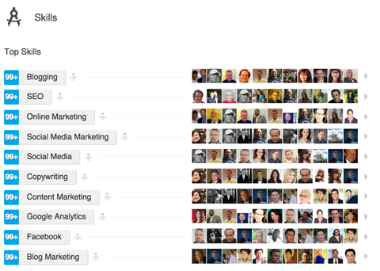

# 🎓 Capacitação

## **Formação acadêmica**

Evidentemente as informações solicitadas e, se possível, inserir as _Atividades e Grupos_**, que façam sentido e sejam relevantes \(ex.: organização de eventos de mentorias para colegas da faculdade\)**. Isso fará com que o visitante perceba que você é participativa e bem engajada com os programas e eventos externos, seja pela faculdade, empresa ou qualquer outra instituição.

Em _Descrição_, coloque as suas percepções sobre as disciplinas. Apresente um pouco o seu lado crítico de tudo o que leu, aprendeu e escutou no meio acadêmico.

## **Formações complementares**

Vale você inserir os eventos e cursos que participou, sejam eles online ou presenciais.

## **Competências e Recomendações**

Esta é uma das melhores atitudes que você pode ter quando queira ratificar ou reforçar as competências dos seus contatos. Como você, cada um terá escolhido algumas “skills” para ilustrar suas principais capacidades, cabe a cada contato favorecer ao outro quando confirma que trata-se de uma pessoa efetivamente competente em algum campo.

Para aproveitar o recurso, você só precisa entrar no perfil de qualquer um dos seus contatos e procurar o campo “Competências e Recomendações” e ir clicando no que acredite que seu contato têm maior capacidade.

